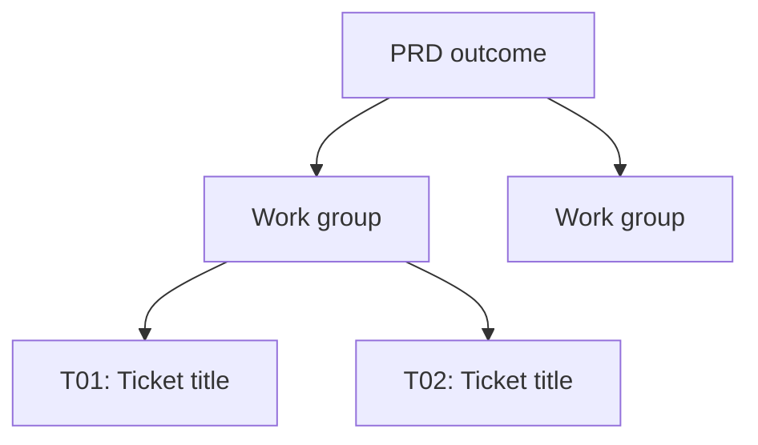

# Output

Return only:

1. One sentence summarizing the breakdown. If the fifth review did not pass, state that the result is best effort and name the unresolved coverage gaps.
2. The complete ordered ticket list.
3. A Mermaid decomposition tree of the work.

Never create, publish, or modify issues, files, or issue-tracker records.

Use this format for every ticket:

```md
### T01: Short descriptive title

**Blocked by:** None

**What to build**

Describe the end-to-end observable behaviour delivered by this ticket.
State any requirement assumption that the PRD leaves unresolved.

**Acceptance criteria**

- [ ] Concrete observable criterion
- [ ] Concrete observable criterion
- [ ] Appropriate tests or verification pass
```

Prefer outcomes over implementation mechanics. Mention file paths or code only when essential to understanding the ticket.

After the tickets, add a `## Task tree` Mermaid diagram:



The diagram is a decomposition tree, not a dependency graph. Include every ticket exactly once as a leaf. Use intermediate work-group nodes when needed, and give each node no more than two children. Keep ticket blockers authoritative.
