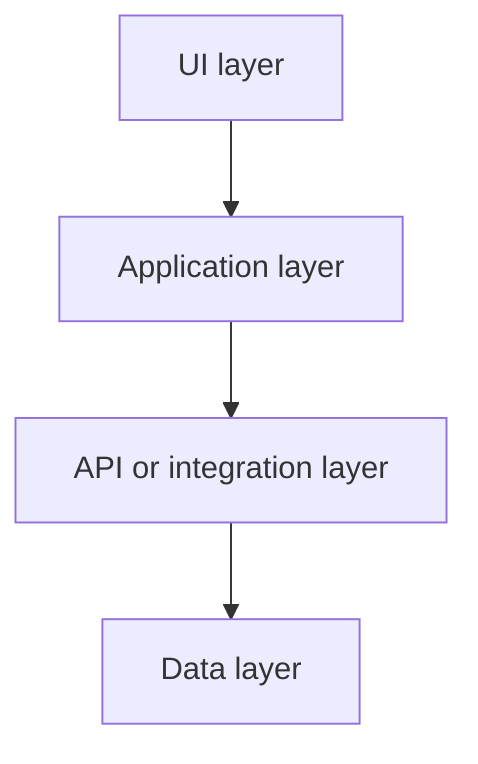

[When technical details are incomplete, place this warning before the PRD:]

> [!WARNING]
> The technical specification is incomplete: [missing or unclear areas]. Consider using `discuss-task` to resolve these implementation decisions.

# PRD: [Title]

## Users (who)

- [User group]

## Problem (why)

- [Problem]

## Acceptance Criteria / Requirements (what)

- **Given** [shared context]
  - **When** [action]
    - **Then** [outcome]
  - **When** [different action]
    - **Then** [different outcome]
    - **And** [additional outcome]
- **Given** [other context]
  - **When** [action]
    - **And** [additional condition or action]
      - **Then** [outcome]

## Technical (how)

### Architecture diagram



### File tree

```text
[path/to/feature]/
├── [file-to-add-or-change]
└── [nested-directory]/
    └── [file-to-add-or-change]
```

### Implementation details

- **Architecture:** [System structure and component boundaries]
- **UI:** [UI layers, components, states, and interactions]
- **API and integrations:** [Endpoints, contracts, and external systems]
- **Data and state:** [Models, persistence, validation, and state changes]
- **Errors and edge cases:** [Failure behavior, recovery, and observability]
- **Testing:** [Automated tests and verification]
- **Migration and rollout:** [Compatibility, migration, deployment, and rollback]
- [Mark relevant missing decisions as unspecified; omit irrelevant categories]

### Technical constraints

- [One confirmed constraint explicitly settled in the discussion or required by authoritative project instructions]
- [One additional confirmed constraint]
- **Unspecified:** [One unresolved constraint decision; include it in the warning and suggest `discuss-task`]
- **Unspecified:** [One additional unresolved constraint decision]

[Write one constraint per line. Do not infer constraints from general best practices.]

## Constraints

- [Constraint]
